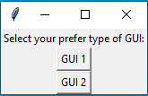
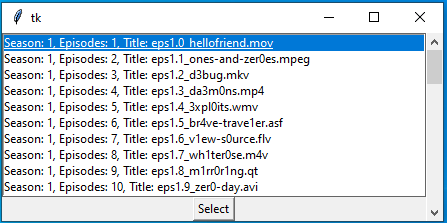
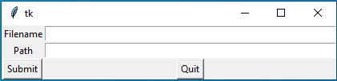
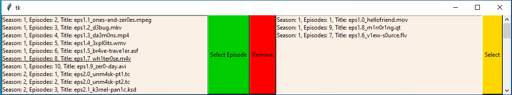

# TV Series GUI
This is a GUI that helps users download information about the series they are interested in.

Select a GUI and input the name of the TV series. After selecting the available episodes, click submit to input the name and directory
to save the information. It will then return the information about the episodes as a .csv.

Select the GUI; They both perform the same task, however differ in the look and accessibility.

The episodes are listed for the "Mr.Robot" TV series. The highlighted episodes can be selected for information.

After selection, the GUI will ask for the name and filepath for receiving information.

This is GUI 2, more accessible for users.
